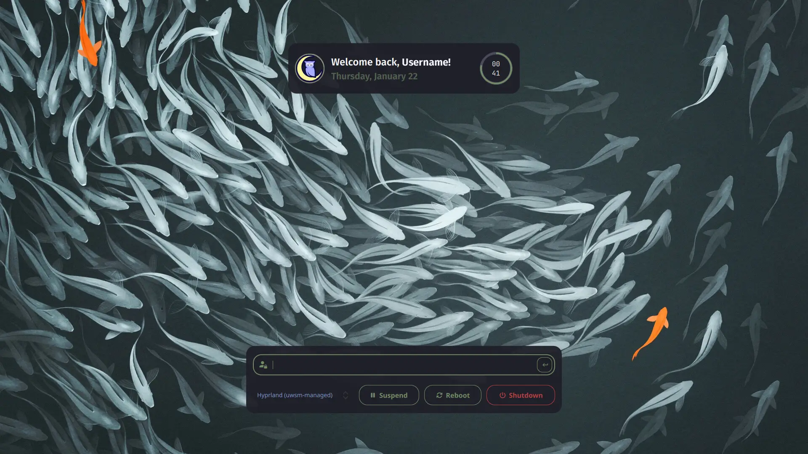

# Noctalia SDDM Theme (unofficial)

This repo represents my current attempts to mimic the Noctalia lock screen as a
theme for SDDM with the kanagawa color sheme as default

Inspiration: [Noctalia SDDM Theme](https://github.com/mahaveergurjar/sddm/tree/noctalia)
and [Noctalia Dev](https://noctalia.dev/)

> [!NOTE]
> Most of the scripts were made with the help of Chatgipity + some common sense.
> First time for me diving into `.qml` language.



## Features

- Multiple user support (clicking top card allows you to switch between users)
- Color sync with Notcatlia-Shell via user-templates (optional)
- Basic script for instalation / removal in default SDDM config `install.sh` `uninstall.sh`
  - theme dir : `/usr/share/sddm/themes/noctalia`
  - sddm.conf : `/etc/sddm.conf`
  - shell integration: `~/.config/noctalia/user-templates.toml` (optional)
- Wallpaper sync with Noctalia-Shell via script `sync-shell-wallpaper.sh` (optional)
- Various customizable settings via `theme.config` or `theme.template.config`

> [!NOTE] - Dependencies
> `qt5-graphicaleffects` and `qt5-quickcontrols2`
> Or their equivalent Qt6 counterparts

### Curent WIP

- Clean-up refactor and optimize

## Instalation

Clone repo with `git clone https://github.com/mda-dev/noctalia-sddm-theme.git noctalia`

<details>
  <summary> Autotomatic (with scripts) </summary>
  Run the installer script from within the noctalia folder.

```sh
./install.sh
```

You will be prompted during the installation for optional
Noctalia-Shell color integration

For wallpaper sync there is no script yet [Manual Install](#wallpaper-sync)

If you install / configure the sync "features" you will need to change
the color scheme and wallpaper once for changes to take effect.

After you can use the [Test command](#test-theme-installation)

</details>

<details>
  <summary>
    Manual (scriptless)
  </summary>

### Theme

Copy directory to sddm themes with `sudo cp -r noctalia /usr/share/sddm/themes`

Activate theme by opening `/etc/sddm.conf` and changing the `Current` key to the following:

```ini
[Theme]
Current=noctalia
```

### Noctalia-Shell (optional)

Set file permissions for theme.conf (needed for Noctalia-Shell)

```sh
sudo chmod 664 "/usr/share/sddm/themes/noctalia/theme.conf"
```

### Color-Sync

Enable User Templates in Noctalia-Shell `Settings > Color Schemes > Templates`

Edit `~/.config/noctalia/user-templates.toml` Add the following lines to the bottom:

```ini
# SDDM GREETER
[templates.sddm]
input_path = "/usr/share/sddm/themes/noctalia/theme.template.conf"
output_path = "/usr/share/sddm/themes/noctalia/theme.conf"
```

### Wallpaper-sync

Open Noctalia-Shell `Settings > Hooks` and add the following inside
"Wallpaper changed" then press the Test button

```sh
/usr/share/sddm/themes/noctalia/sync-shell-wallpaper.sh
```

Set file permissions for wallpaper.png (gets overwritten by the script)

```sh
sudo chmod 664 "/usr/share/sddm/themes/noctalia/Assets/wallpaper.png"
```

</details>

## Test theme installation

```sh
sddm-greeter --test-mode --theme /usr/share/sddm/themes/noctalia
```

## Configuration

The place where you can configure some settings changes depending if you enable Color-Sync

<details>
<summary>With Color-Sync</summary>
Open `theme.template.conf` with your favorite editor and change any of the values 
you see fit and then refresh your theme within Noctalia settings

> [!CAUTION]
> Do not change values start with the letter `m` ex `mPrimary`, those are set by Noctalia-Shell
> whenever you change your theme.
> The Color-Sync won't work anymore

</details>

<details>
<summary>Without Color-Sync (standalone)</summary>
Open `theme.conf` file with your favorite editor and change any of the values you see fit.

```sh
sudo nano /etc/share/sddm/themes/noctalia/theme.conf
```

</details>
